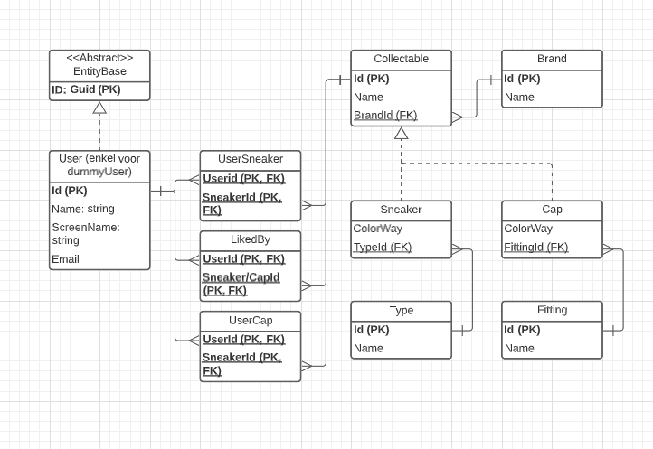

# Voorstel PRI

## Caps-N-Sneakers

Het doel van dit project is om je eigen collectie van caps (petten) en sneakers bij te houden, als ook een collectie van andere mensen (gebruikers) hun caps en sneakers te bekijken.
Je kan ook caps of sneakers van andere mensen "liken" en in je favorieten bijhouden.

De sneakers en caps hebben ook een merk(brand) en een type.

### Fases

Voor de eerste fase van het project zullen er "dummy" users worden toegevoegd om een collectie te kunnen toewijzen aan een gebruiker. Deze wordt dan vervangen door een identity user in fase 2.

### Controllers

- UsersController &rarr; Dient enkel ter ondersteuning om persoonlijke collecties te bekijken.
- SneakersController &rarr; Volledige CRUD
- CapsController &rarr; Volledige CRUD
- BrandsController &rarr; Volledige CRUD
- TypesController &rarr; Volledige CRUD
- FittingsController &rarr; Volledige CRUD
- LikesController &rarr; Like en Dislike functionaliteit

### ERD

Voor de effectieve uitwerking zal er gebruik gemaakt worden van abstracte klassen die in deze ERD niet aanwezig zijn.